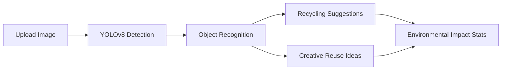

# 🌱 UnTrashify - E-waste Detection App

<div align="center">


**Turn your e-waste into treasure with AI-powered detection & creative reuse ideas**

[](https://flask.palletsprojects.com/)
[](https://reactjs.org/)
[](https://github.com/ultralytics/ultralytics)
[](LICENSE)

</div>

## 📱 Demo

<!-- Add a GIF or screenshot of your application here -->


*👆 Replace with a GIF of Trashify in action!*

## ✨ Features

- 🔍 **Detect E-waste Objects** - Upload images to identify batteries, chargers, circuit boards, and more
- ♻️ **Recycling Guidance** - Get proper disposal recommendations for each detected item
- 💡 **Creative Reuse Ideas** - AI-generated suggestions to repurpose e-waste into new products
- 📊 **Environmental Impact** - Track your contribution to saving resources and reducing waste
- 🤖 **Powered by YOLOv8** - Fast, accurate object detection using state-of-the-art computer vision

## 🚀 Quick Start

### Prerequisites

```bash
# You'll need:
✅ Python 3.8+ with pip
✅ Node.js with npm
✅ Git
```

### Installation in 3 Simple Steps

<details>
<summary>1️⃣ Clone & Setup</summary>

```bash
# Clone repository
git clone https://github.com/yourusername/trashify.git
cd trashify

# Set up Python environment
python -m venv venv
source venv/bin/activate  # On Windows: venv\Scripts\activate
```
</details>

<details>
<summary>2️⃣ Install Dependencies</summary>

```bash
# Install backend dependencies
cd backend
pip install -r requirements.txt

# Install frontend dependencies
cd ../frontend
npm install
```
</details>

<details>
<summary>3️⃣ Start Application</summary>

```bash
# Choose your OS:

# Windows
start.bat

# macOS/Linux
chmod +x start.sh
./start.sh
```

Then open http://localhost:3000 in your browser! 🎉
</details>

## 🧠 How It Works



1. **Upload an image** containing e-waste items
2. **AI analyzes the image** using YOLOv8 object detection
3. **Get tailored recommendations** for proper recycling
4. **Discover creative ways** to repurpose your e-waste
5. **Track your environmental impact** with intuitive statistics

## 🔧 Tech Stack

<table>
  <tr>
    <td align="center" width="96">
      
      <br>Python
    </td>
    <td align="center" width="96">
      
      <br>Flask
    </td>
    <td align="center" width="96">
      
      <br>React
    </td>
    <td align="center" width="96">
      
      <br>JavaScript
    </td>
    <td align="center" width="96">
      
      <br>Material UI
    </td>
  </tr>
</table>

## 💻 For Developers

### Project Structure

```
trashify/
├── 🐍 backend/                  # Flask backend
│   ├── model/                  # YOLOv8 model
│   ├── static/                 # Processed images
│   ├── app.py                  # Main Flask app
│   └── requirements.txt        # Dependencies
├── ⚛️ frontend/                 # React frontend
│   ├── public/
│   ├── src/
│   │   ├── components/
│   │   ├── App.js
│   │   └── index.js
│   └── package.json
├── 📊 scripts/                  # Utility scripts
│   ├── data/                   # Dataset preparation
│   └── model/                  # Model training
└── 📝 README.md                 # You are here!
```

### Training Your Own Model

We use the [E-waste Dataset from Kaggle](https://www.kaggle.com/datasets/kaustubh2402/ewaste-dataset) to train our YOLOv8 model.

<details>
<summary>View training instructions</summary>

```bash
# 1. Download the dataset
cd scripts/data
python prepare_dataset.py --input-dir "path/to/ewaste-dataset" --output-dir ../../datasets/ewaste

# 2. Train the model
cd ../model
python train_yolo.py --data ../../datasets/ewaste/data.yaml --pretrained --epochs 50
```
</details>

## 🤝 Contributing

We love contributions! Here's how you can help:

1. 🍴 **Fork** the repository
2. 🌿 Create a **branch** (`git checkout -b feature/amazing-idea`)
3. 💻 Make your **changes**
4. 🧪 **Test** your changes
5. 📤 **Push** to your branch (`git push origin feature/amazing-idea`)
6. 🔄 Open a **Pull Request**

See our [Contributing Guide](CONTRIBUTING.md) for more details.

## 📄 License

This project is licensed under the MIT License - see the [LICENSE](LICENSE) file for details.

## 🙏 Acknowledgements

- [Ultralytics YOLOv8](https://github.com/ultralytics/ultralytics) for the object detection model
- [Kaggle E-waste Dataset](https://www.kaggle.com/datasets/kaustubh2402/ewaste-dataset) for training data
- [Material-UI](https://mui.com/) for the beautiful UI components
- Icons by [Material Design Icons](https://materialdesignicons.com/)

---

<div align="center">

**♻️ Reduce. Reuse. Recycle. Rethink. ♻️**

[GitHub](https://github.com/yourusername/trashify) · [Issues](https://github.com/yourusername/trashify/issues) · [Contact](mailto:your.email@example.com)

</div> 
